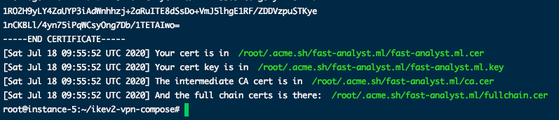
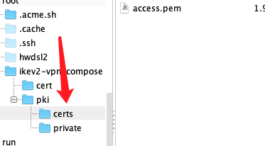
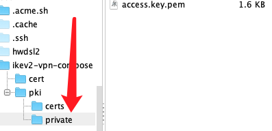

**[ReadRou](https://github.com/ReadRou)** & **[mainnika](https://github.com/mainnika)** 

Purpose: The issues dialog contains the detailed process of creating a vpn.


**[ReadRou](https://github.com/ReadRou)**:

Some things have happened around me these days, i just started to try now.

But I still can't run, I think there is a problem with the certificate configuration.

I created the ikev2 protocol as follows.

# Apply for domain name & generate certificate

``` bash
acme.sh --issue -d fast-analyst.ml --standalone

acme.sh --installcert -d api.fast-analyst.ml \
        --key-file /root/.acme.sh/api.fast-analyst.ml/api.fast-analyst.ml.key \
        --fullchain-file /root/.acme.sh/api.fast-analyst.ml/fullchain.cer \
        --reloadcmd "service nginx restart"
```

The following is the information returned by `lets encrypt`



I have a total of four certificate files

``` bash
fast-analyst.ml.cer
fast-analyst.ml.key
ca.cer
fullchain.cer
```

Below is the certificate file I configured into docker. (Rename directly.)

``` bash
fast-analyst.ml.cer -> access.pem
fast-analyst.ml.key -> access.key.pem
```

location of access.pem



location of access.key.pem



# Client connection

When I used the built-in vpn of the iPhone to connect to the server, such an exception occurred on the server side.


``` bash
access_1  | sysctl: setting key "net.ipv4.ip_forward": Read-only file system
access_1  | Starting strongSwan 5.3.5 IPsec [starter]...
access_1  | sh: 1: modprobe: not found
access_1  | no netkey IPsec stack detected
access_1  | sh: 1: modprobe: not found
access_1  | no KLIPS IPsec stack detected
access_1  | no known IPsec stack detected, ignoring!
access_1  | charon (16) started after 780 ms
access_1  | 00[DMN] Starting IKE charon daemon (strongSwan 5.3.5, Linux 4.15.0-1078-gcp, x86_64)
access_1  | 00[LIB] building CRED_PRIVATE_KEY - RSA failed, tried 9 builders
access_1  | 00[LIB] loaded plugins: charon test-vectors aes rc2 sha1 sha2 md4 md5 random nonce x509 revocation constraints pubkey pkcs1 pkcs7 pkcs8 pkcs12 pgp dnskey sshkey pem openssl fips-prf gmp agent xcbc hmac gcm attr kernel-netlink resolve socket-default connmark farp stroke updown eap-identity eap-sim eap-sim-pcsc eap-aka eap-aka-3gpp2 eap-simaka-pseudonym eap-simaka-reauth eap-md5 eap-gtc eap-mschapv2 eap-dynamic eap-radius eap-tls eap-ttls eap-peap eap-tnc xauth-generic xauth-eap xauth-pam xauth-noauth tnc-tnccs tnccs-20 tnccs-11 tnccs-dynamic dhcp lookip error-notify certexpire led addrblock unity
access_1  | 00[LIB] dropped capabilities, running as uid 0, gid 0
access_1  | 00[JOB] spawning 16 worker threads
access_1  | 12[NET] received packet: from 116.22.133.217[8040] to 172.17.0.2[500] (604 bytes)
access_1  | 12[ENC] parsed IKE_SA_INIT request 0 [ SA KE No N(REDIR_SUP) N(NATD_S_IP) N(NATD_D_IP) N(FRAG_SUP) ]
access_1  | 12[IKE] 116.22.133.217 is initiating an IKE_SA
access_1  | 12[IKE] local host is behind NAT, sending keep alives
access_1  | 12[IKE] remote host is behind NAT
access_1  | 12[IKE] DH group MODP_2048 inacceptable, requesting MODP_1024
access_1  | 12[ENC] generating IKE_SA_INIT response 0 [ N(INVAL_KE) ]
access_1  | 12[NET] sending packet: from 172.17.0.2[500] to 116.22.133.217[8040] (38 bytes)
access_1  | 13[NET] received packet: from 116.22.133.217[8040] to 172.17.0.2[500] (476 bytes)
access_1  | 13[ENC] parsed IKE_SA_INIT request 0 [ SA KE No N(REDIR_SUP) N(NATD_S_IP) N(NATD_D_IP) N(FRAG_SUP) ]
access_1  | 13[IKE] 116.22.133.217 is initiating an IKE_SA
access_1  | 13[IKE] local host is behind NAT, sending keep alives
access_1  | 13[IKE] remote host is behind NAT
access_1  | 13[ENC] generating IKE_SA_INIT response 0 [ SA KE No N(NATD_S_IP) N(NATD_D_IP) N(FRAG_SUP) N(MULT_AUTH) ]
access_1  | 13[NET] sending packet: from 172.17.0.2[500] to 116.22.133.217[8040] (320 bytes)
access_1  | 14[NET] received packet: from 116.22.133.217[8040] to 172.17.0.2[500] (476 bytes)
access_1  | 14[ENC] parsed IKE_SA_INIT request 0 [ SA KE No N(REDIR_SUP) N(NATD_S_IP) N(NATD_D_IP) N(FRAG_SUP) ]
access_1  | 14[IKE] received retransmit of request with ID 0, retransmitting response
access_1  | 14[NET] sending packet: from 172.17.0.2[500] to 116.22.133.217[8040] (320 bytes)
access_1  | 15[NET] received packet: from 116.22.133.217[8040] to 172.17.0.2[500] (476 bytes)
access_1  | 15[ENC] parsed IKE_SA_INIT request 0 [ SA KE No N(REDIR_SUP) N(NATD_S_IP) N(NATD_D_IP) N(FRAG_SUP) ]
access_1  | 15[IKE] received retransmit of request with ID 0, retransmitting response
access_1  | 15[NET] sending packet: from 172.17.0.2[500] to 116.22.133.217[8040] (320 bytes)
access_1  | 05[NET] received packet: from 116.22.133.217[8040] to 172.17.0.2[500] (476 bytes)
access_1  | 05[ENC] parsed IKE_SA_INIT request 0 [ SA KE No N(REDIR_SUP) N(NATD_S_IP) N(NATD_D_IP) N(FRAG_SUP) ]
access_1  | 05[IKE] received retransmit of request with ID 0, retransmitting response
access_1  | 05[NET] sending packet: from 172.17.0.2[500] to 116.22.133.217[8040] (320 bytes)
access_1  | 04[NET] received packet: from 116.22.133.217[8040] to 172.17.0.2[500] (476 bytes)
access_1  | 04[ENC] parsed IKE_SA_INIT request 0 [ SA KE No N(REDIR_SUP) N(NATD_S_IP) N(NATD_D_IP) N(FRAG_SUP) ]
access_1  | 04[IKE] received retransmit of request with ID 0, retransmitting response
access_1  | 04[NET] sending packet: from 172.17.0.2[500] to 116.22.133.217[8040] (320 bytes)
access_1  | 02[IKE] sending keep alive to 116.22.133.217[8040]
access_1  | 01[JOB] deleting half open IKE_SA after timeout
access_1  | 06[NET] received packet: from 116.22.133.217[8040] to 172.17.0.2[500] (604 bytes)
access_1  | 06[ENC] parsed IKE_SA_INIT request 0 [ SA KE No N(REDIR_SUP) N(NATD_S_IP) N(NATD_D_IP) N(FRAG_SUP) ]
access_1  | 06[IKE] 116.22.133.217 is initiating an IKE_SA
access_1  | 06[IKE] local host is behind NAT, sending keep alives
access_1  | 06[IKE] remote host is behind NAT
access_1  | 06[IKE] DH group MODP_2048 inacceptable, requesting MODP_1024
access_1  | 06[ENC] generating IKE_SA_INIT response 0 [ N(INVAL_KE) ]
access_1  | 06[NET] sending packet: from 172.17.0.2[500] to 116.22.133.217[8040] (38 bytes)
access_1  | 11[NET] received packet: from 116.22.133.217[8040] to 172.17.0.2[500] (476 bytes)
access_1  | 11[ENC] parsed IKE_SA_INIT request 0 [ SA KE No N(REDIR_SUP) N(NATD_S_IP) N(NATD_D_IP) N(FRAG_SUP) ]
access_1  | 11[IKE] 116.22.133.217 is initiating an IKE_SA
```

The client's error report is like this.

``` 
The VPN Server did not respond.
```

The last is the file details of ipsec.conf & ipsec.secrets.

``` conf


# ipsec.conf - strongSwan IPsec configuration file

# basic configuration

config setup
	charondebug="ike 1, knl 1, cfg 0"
	# strictcrlpolicy=yes
	uniqueids = no

# Add connections here.

# Sample VPN connections

#conn sample-self-signed
#      leftsubnet=10.1.0.0/16
#      leftcert=selfCert.der
#      leftsendcert=never
#      right=192.168.0.2
#      rightsubnet=10.2.0.0/16
#      rightcert=peerCert.der
#      auto=start

#conn sample-with-ca-cert
#      leftsubnet=10.1.0.0/16
#      leftcert=myCert.pem
#      right=192.168.0.2
#      rightsubnet=10.2.0.0/16
#      rightid="C=CH, O=Linux strongSwan CN=peer name"
#      auto=start

conn ikev2-vpn
	auto=add
	compress=no
	type=tunnel
	keyexchange=ikev2
	fragmentation=yes
	forceencaps=yes
	ike=aes256-sha1-modp1024,aes128-sha1-modp1024,3des-sha1-modp1024!
	esp=aes256-sha256,aes256-sha1,3des-sha1!
	dpdaction=clear
	dpddelay=300s
	rekey=no
	left=%any
	leftid=@fast-analyst.ml
	leftcert=/etc/ipsec.d/certs/access.pem
	leftsendcert=always
	leftsubnet=0.0.0.0/0
	right=%any
	rightid=%any
	rightauth=eap-mschapv2
	rightsourceip=10.10.10.0/24
	rightdns=1.1.1.1
	rightsendcert=never
	eap_identity=%identity
```


ipsec.secrets

``` conf
# This file holds shared secrets or RSA private keys for authentication.

# RSA private key for this host, authenticating it to any other host
# which knows the public part.

fast-analyst.ml : RSA "/etc/ipsec.d/private/access.key.pem"

vpnuser %any% : EAP "k123456"
```


**[mainnika](https://github.com/mainnika)**:

[@ReadRou](https://github.com/ReadRou) try to use `fullchain.cer` as the `access.pem`